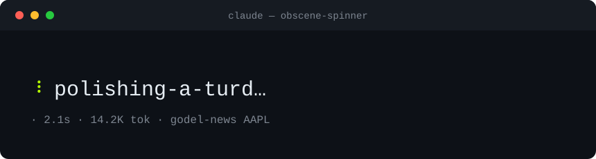

# obscene-spinner

```bash
brew tap noctaIO/tap
brew install obscene-spinner
spin
```

That puts `spin` (and `obscene-spinner`) on your PATH. Newer Homebrew gates third-party taps, so if it asks, run `brew trust noctaio/tap` first.

Or skip Homebrew — it's still one Python 3 file, no pip, no build, no config:

```bash
git clone https://github.com/noctaIO/obscene-spinner
cd obscene-spinner
./spin.py
```

Run it bare and you get **the gallery**: every pack on the left, each one animating live in its own glyphs and its own colour, a detail pane on the right showing exactly what Claude Code will draw. Arrow keys to browse, `/` to search, Enter to make it your real spinner. `q` to leave without touching anything.



## Why

Claude Code lets you swap out the verbs it shows while it's working on your prompt. The stock set is whimsical: "Noodling", "Lollygagging", "Shenaniganing". Pleasant. A little pleased with itself.

This is the other set. The one a senior dev mutters at 2am when the build is on fire: `faffing`, `unfucking`, `yak-shaving`, `yeeting-to-prod`, `polishing-a-turd`, `crashing-out`. Then twenty more packs besides — pirate, eldritch, corporate, Shakespearean, zen — plus thirty-six animations and a dozen colour themes you can mix into any of them.



There's a catch with the real spinner: it only swaps a verb when a new operation starts, so a whole session shows you maybe five of the eighty and none of the good ones. The previews here run them on a timer instead, fast enough that the full pack actually goes past.

## Using it

```bash
spin                          # the gallery (this is the one you want)
spin --list                   # every pack, animation and theme, as text
spin --list --json            # the same, machine-readable

spin --pack eldritch          # preview a pack in the terminal
spin --pack pirate --spinner moon --theme void   # mix and match
spin --random                 # surprise me
spin --wall                   # every animation running at once

spin --set british            # apply a pack, no menu
spin --mix pirate wizard zen  # blend several packs into one spinner
spin --status                 # what's active right now
spin --restore                # put back the spinner you had before

spin --sfw                    # hide the rude packs (gallery, --list, --random)
spin --search dns             # filter packs by name, description or verb
spin --once                   # one verb and quit, handy for status lines
```

`--set` and `--restore` are the no-menu paths: wire them to a shell alias or a Claude Code `/spinner` command and flip packs in a keystroke. Everything that writes to your settings is reversible — see [Applying and undoing](#applying-and-undoing).

### In the gallery

| key | does |
| --- | --- |
| `↑` `↓` / `j` `k` | move between packs |
| `enter` | apply this pack to Claude Code |
| `/` | search packs *and their verbs* — `enter` accepts, `esc` clears |
| `tab` | cycle the category filter |
| `s` | toggle the safe-for-work filter |
| `f` / `F` | cycle the animation forwards / back |
| `t` / `T` | cycle the colour theme forwards / back |
| `w` | wall mode — every animation at once |
| `r` | randomise pack, animation and theme |
| `u` | restore the spinner you had before |
| `?` | key help |
| `q` | quit, changing nothing |

The right-hand pane draws a box exactly **56 columns** wide — the width Claude Code chops the verb line at — so you can see at a glance which verbs are living dangerously.

## What ships

<!-- BEGIN GENERATED TABLES -->

| pack | verbs | rating | what it is |
| --- | --- | --- | --- |
| `profanity` | 80 | nsfw | the original 2am verb pack |
| `british` | 50 | nsfw | everything has gone pear-shaped, mildly |
| `scottish` | 40 | nsfw | pure bealing, so it is |
| `cope` | 42 | mild | the five stages, compressed into one build |
| `prod` | 40 | mild | forty things you should never do to a live system |
| `sysadmin` | 40 | mild | it was DNS. it is always DNS. |
| `honest` | 49 | sfw | what the work actually is, most days |
| `corporate` | 44 | sfw | circling back to socialise the deck |
| `eldritch` | 44 | sfw | something in the dependency tree is awake |
| `pirate` | 40 | sfw | the rum is gone and so is the build |
| `medieval` | 40 | sfw | the siege is going badly |
| `hacker` | 40 | sfw | jacked in, ice broken, logs wiped |
| `noir` | 39 | mild | it was raining. it's always raining. |
| `existential` | 39 | sfw | one must imagine the compiler happy |
| `chef` | 40 | sfw | yes chef. behind. corner. hot pan. |
| `wizard` | 39 | sfw | a wizard is never late |
| `commentator` | 38 | sfw | absolute scenes in the terminal |
| `shakespeare` | 39 | mild | thou art erroring, and most foully |
| `genz` | 39 | mild | let him cook |
| `gymbro` | 39 | mild | just one more set |
| `zen` | 35 | sfw | the build is neither late nor early |
| `chaos` | live | nsfw | a shuffled sample of every pack at once |
| `news` | live | sfw | the latest wire headlines, refreshed in the background |

| animation | frames | animation | frames |
| --- | --- | --- | --- |
| `braille` | `⠋⠙⠹⠸⠼⠴⠦⠧` | `braille2` | `⣾⣽⣻⢿⡿⣟⣯⣷` |
| `braille3` | `⠁⠂⠄⡀⢀⠠⠐⠈` | `dots` | `⢹⢺⢼⣸⣇⡧⡗⡏` |
| `bounce` | `⠁⠂⠄⠂` | `line` | `|/-\` |
| `layer` | `-=≡=` | `pipe` | `┤┘┴└├┌┬┐` |
| `arc` | `◜◠◝◞◡◟` | `circle` | `◐◓◑◒` |
| `quadrant` | `◴◷◶◵` | `square` | `◰◱◲◳` |
| `half` | `◧◨◩◪` | `triangle` | `◢◣◤◥` |
| `corner` | `▖▘▝▗` | `toggle` | `⊶⊷` |
| `switch` | `▮▯` | `blocks` | `▁▂▃▄▅▆▇█` |
| `grow` | `▏▎▍▌▋▊▉█` | `noise` | `░▒▓█▓▒` |
| `pulse` | `·•●•` | `star` | `✶✸✹✺✹✷` |
| `arrows` | `←↖↑↗→↘↓↙` | `arrows2` | `⇐⇖⇑⇗⇒⇘⇓⇙` |
| `orbit` | `◜◝◞◟` | `flip` | `` _-`'´-_  `` |
| `dqpb` | `dqpb` | `binary` | `0010 1010 1101 0110` |
| `bar` | `▰▱▱▱▱ ▰▰▱▱▱ ▰▰▰▱▱ ▰▰▰▰▱` | `point` | `∙∙∙ ●∙∙ ∙●∙ ∙∙●` |
| `balloon` | ` .oO@* ` | `moon` | `🌑🌒🌓🌔🌕🌖🌗🌘` |
| `earth` | `🌍🌎🌏` | `clock` | `🕐🕑🕒🕓🕔🕕🕖🕗` |
| `hearts` | `💛💙💜💚🧡` | `static` | `●` |

| theme | style | theme | style |
| --- | --- | --- | --- |
| `acid` | solid | `ember` | gradient |
| `void` | gradient | `ice` | gradient |
| `matrix` | gradient | `blood` | gradient |
| `gold` | gradient | `vapor` | gradient |
| `deep` | gradient | `bone` | solid |
| `mono` | solid | `rainbow` | rainbow |

<!-- END GENERATED TABLES -->

Ratings: `sfw` is safe to have on screen in an open-plan office, `mild` is cheerfully crude, `nsfw` is the reason the project is called this. `spin --sfw` filters to the first group, and so does `s` in the gallery.

Two packs are **live** rather than fixed: `news` pulls real headlines from a JSON feed, and `chaos` deals a shuffled hand from every other pack each time you apply it.

## Applying and undoing

Picking a pack writes `spinnerVerbs` into `~/.claude/settings.json` with mode `"replace"`, atomically, leaving every other setting exactly as it was:

```json
{
  "spinnerVerbs": { "mode": "replace", "verbs": ["faffing", "unfucking", "..."] }
}
```

Because `"replace"` throws out the polite defaults, the **first** time you apply anything, whatever `spinnerVerbs` you had is copied to `~/.claude/spinner-backup.json` — and only the first time, so a hundred more applies can't bury the original. `spin --restore` puts it back, byte for byte, and deletes the key entirely if you didn't have one to begin with.

```bash
spin --set eldritch    # off you go
spin --restore         # ✓ restored your previous spinnerVerbs.
```

Fair warning either way: this is not the version you want on screen during a demo.

## Your own packs

Drop a JSON file in `~/.claude/spinner-packs/` and it shows up in the gallery beside the built-ins:

```json
{
  "id": "mine",
  "name": "My Pack",
  "desc": "what I'm actually doing",
  "category": "custom",
  "rating": "sfw",
  "spinner": "pulse",
  "theme": "ice",
  "verbs": ["fiddling", "tinkering", "poking"]
}
```

Only `id` and `verbs` are required. Give it the `id` of a built-in and yours wins — that's how you override one.

```bash
spin --export pirate -o pirate.json   # start from a pack you like
spin --import mine.json               # install one (validates first)
```

Bad files never stop the tool: a malformed pack is reported and skipped, and a single over-long verb or unknown theme name costs you that verb or falls back to a default rather than binning the whole pack.

## News mode

Same spinner, different pack: live headlines instead of verbs. Out of the box it reads a markets wire — the top Reuters market stories, refreshed in the background — one headline at a time.

```bash
spin --pack news                       # ~5s per headline, refreshes as it runs
spin --pack news --interval 1.2        # faster churn
spin --pack news --news-url URL        # or set SPIN_NEWS_URL
spin --set news                        # make the wire your Claude Code spinner
```

**Read the story:** while the ticker runs, press `n` to pause and read the current headline's summary, then any key to resume (`q` quits). That only works in this standalone ticker, not in Claude Code's own spinner, which Claude Code draws itself.

Point `--news-url` (or `SPIN_NEWS_URL`) at any small JSON endpoint shaped like `{"items": ["headline", ...]}` — objects with `title` and `summary` work too. No network, no feed? It says so and exits instead of hanging.

Headlines get two different treatments, deliberately. In the ticker, each is measured by real screen width — Chinese counts as two columns, accents as zero — then filled right to the edge and capped with `…`, recomputed every frame so it re-fits the instant you resize. But a headline *applied* to Claude Code can't end in a dangling fragment, so it's **shortened** instead: source tag stripped, stock words abbreviated, articles dropped, then trimmed to the leading clause. The result still reads as a headline.

## The verbs

Roughly four moods, because a bad session moves through all of them:

- **British disasters** — faffing, bollocksing, fannying-about, going-tits-up, cocking-it-up
- **Cope** — malding, seething, huffing-copium, dissociating, crashing-out
- **Honest engineering** — yak-shaving, bikeshedding, monkeypatching, footgunning, kludging
- **Do not do this in prod** — yeeting-to-prod, force-pushing-to-main, rm-rf-ing, shipping-and-praying

A single frame, if the animations above won't play in your viewer:



## Terminals that aren't yours

It degrades rather than breaks. `NO_COLOR`, `TERM=dumb`, a pipe, or `--no-color` all produce plain text with no escape codes at all. A 16-colour terminal gets the nearest ANSI colour; a 256-colour one gets the cube; anything advertising `COLORTERM=truecolor` gets the real thing. Colour pairs are allocated on demand and capped at what the terminal actually offers, so a small `TERM` can't crash the gallery. The layout reflows from 200 columns down to about 30, dropping the detail pane and then the key hints as room runs out, and `spin --verbs | head` exits like any other Unix filter.

## Hacking on it

```bash
python3 -m unittest discover -s tests -v   # 118 tests, stdlib only
./spin.py --selftest                       # the same suite, front door
python3 make_demo.py                       # regenerate the SVGs
python3 tools/check_docs.py --write        # regenerate the tables above
```

The tables in this README, the SVGs, and the `--list` output all come from the same registries in `spin.py`, and CI fails if any of them drift. The gallery's layout is drawn against a tiny screen interface with two backends — curses, and a plain character grid — so the whole TUI is rendered and asserted in tests without needing a terminal.

Adding a pack is one entry in `PACKS`. Adding an animation is one entry in `SPINNERS`; the tests will tell you off if its frames aren't all the same display width, because that makes the verb beside it jitter.

The stock verbs are fine. But sometimes the honest status really is `bodging`, and the terminal may as well say so.
